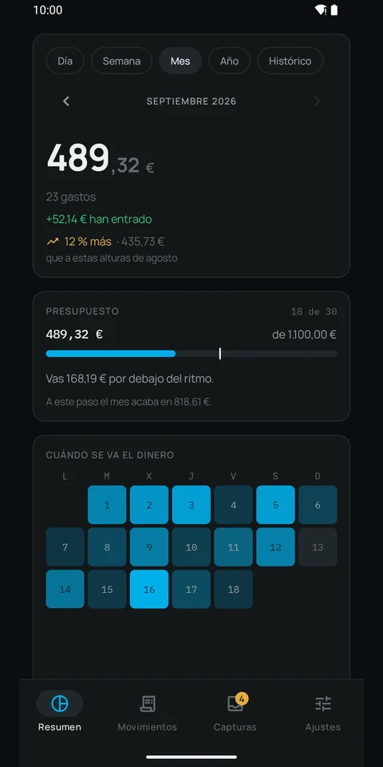
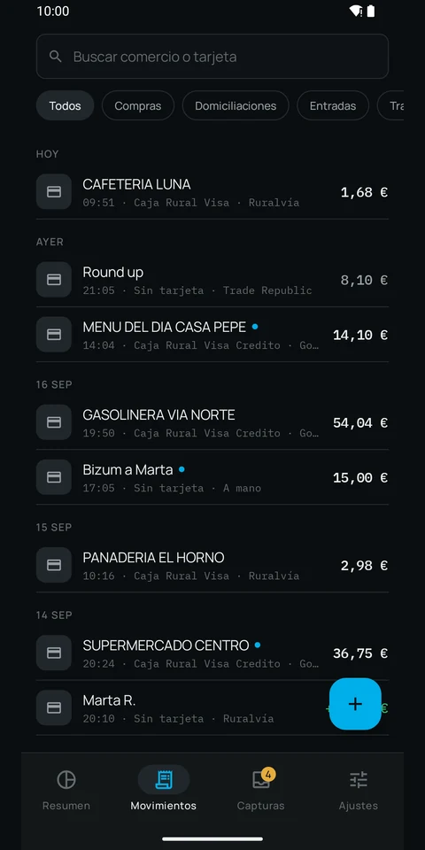
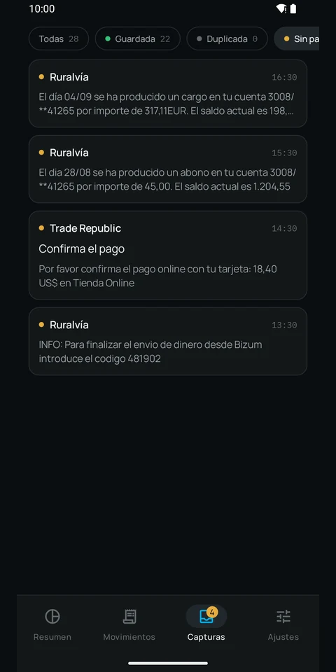
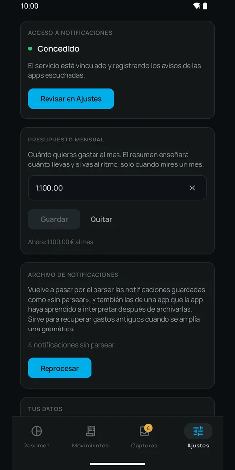

<div align="center">


# Xtracto

**Tus gastos se apuntan solos. Y no salen del móvil.**

[xtracto.app](https://xtracto.app) · [English](https://xtracto.app/en.html) · [Política de privacidad](https://xtracto.app/privacidad.html)

`En prueba cerrada` — [pide entrar en la prueba](https://xtracto.app/prueba-cerrada.html)

</div>

---

Cuando tu banco te avisa de una compra o de un recibo, Xtracto lee ese aviso y lo convierte en un
movimiento. Sin teclear nada, sin conectar tu banco y sin darle tus credenciales a nadie.

## Por qué puedes fiarte

Casi todas las apps de gastos te piden que confíes en su promesa de privacidad. Xtracto no te pide
que confíes: **no declara permiso de acceso a internet**. No es una política, es una limitación
técnica que puedes comprobar tú mismo sobre el archivo que se instala en el móvil.

```
$ aapt2 dump permissions xtracto.apk

package: app.xtracto
uses-permission: name='app.xtracto.DYNAMIC_RECEIVER_NOT_EXPORTED_PERMISSION'
```

Eso es todo. Ese único permiso es interno de las librerías de Android y no da acceso a nada. Si en
esa lista apareciera `android.permission.INTERNET`, la app podría enviar tus datos a algún sitio y
todo lo que dice esta página sería mentira. No aparece.

## Qué hace

- Lee los avisos de un **catálogo cerrado de 216 aplicaciones financieras** —y dentro de él,
  **eliges tú una a una** cuáles vigila— y extrae el importe, el comercio, la tarjeta y la fecha. De
  las demás notificaciones no lee ni guarda nada; de las que apagas, ni siquiera abre el contenido.
- Guarda los movimientos en una **base de datos local** que ninguna otra app puede abrir.
- Te enseña el total del mes, el desglose por tarjeta comparado con el mes anterior, y el historial
  completo con buscador.
- Conserva el aviso original para que puedas comprobar cada importe.
- Oculta la pantalla en las capturas y en la vista de Recientes.
- Te deja **apuntar a mano** lo que ninguna app avisa, como un Bizum enviado. Si luego llega el
  aviso del banco de ese mismo pago, sustituye a tu apunte en vez de duplicarlo.
- Te deja exportarlo todo a CSV cuando quieras.
- Se borra entero al desinstalar, porque no hay copia en ningún otro sitio.

Lo que nunca hace: enviar nada a ningún servidor, pedirte las claves de tu banco, subir tus datos a
la copia de seguridad en la nube, mostrar anuncios o pedirte una cuenta.

> **Xtracto no es una aplicación de banca.** No se conecta a tu banco, no puede consultar tu saldo
> real ni mover dinero. Solo lee los avisos que tu banco ya te manda al móvil.

## Capturas

<div align="center">






</div>

Los importes y los comercios son **inventados**: las capturas se hacen en un emulador con datos de
prueba, nunca sobre el teléfono de nadie, que es donde hay dinero real. Se preparan para la web con
`python3 capturas/preparar.py` a partir de las que van a la ficha de Google Play.

## Si tu banco no está soportado

Xtracto entiende hoy los formatos de aviso de un conjunto concreto de entidades. Si el tuyo usa
otro, la app te lo dirá y podrás **enviarnos el formato sin enviarnos tus datos**: antes de compartir
nada, sustituye importes, fechas, comercios y números por marcadores y te enseña exactamente el
texto que va a salir.

```
El día 01/09 se ha cargado el recibo de FUNDACION EJEMPLO
en tu cuenta 1234/**56789 por importe de 41,52 EUR

                        ↓

El día <fecha> se ha cargado el recibo de <comercio>
en tu cuenta <cuenta> por importe de <importe>
```

Con la plantilla basta para añadir tu banco. **Puedes mandarla desde
[xtracto.app/formato.html](https://xtracto.app/formato.html) sin registrarte en nada**, y si tu banco
ni siquiera está en el catálogo —entonces no hay ningún aviso que copiar— pídelo en
[xtracto.app/pide-tu-banco.html](https://xtracto.app/pide-tu-banco.html), que con el nombre basta.
Mientras tanto, el apunte a mano hace que la app te sirva igual.

Se publica como una incidencia pública en este repositorio, así que no debe llevar ni un solo número
real: un robot revisa cada envío y avisa si detecta cifras.

## Sobre este repositorio

Aquí vive únicamente el **sitio público** de Xtracto y la recepción de formatos de aviso. El código
de la aplicación está en un repositorio privado.

## Contacto

**support@xtracto.app**
